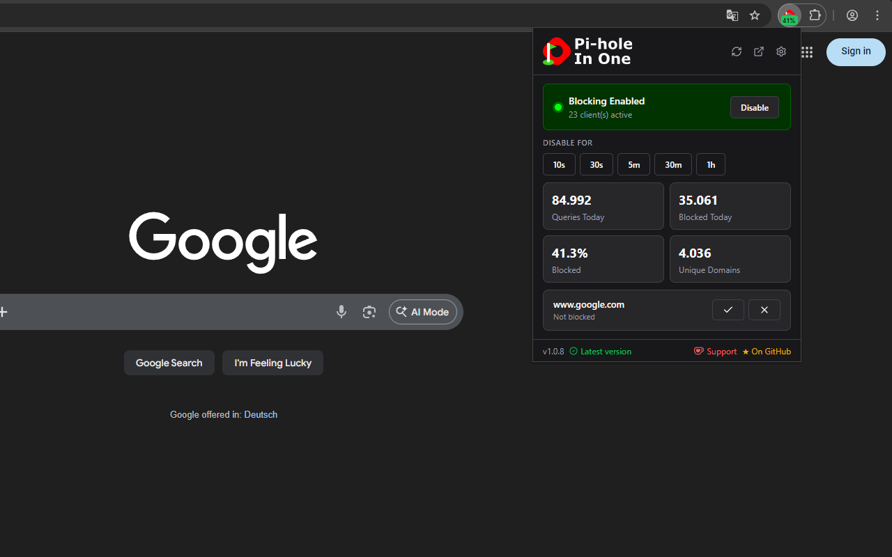

# 

A browser extension to control your Pi-hole conveniently from within the browser.


[](https://crowdin.com/project/pihole-in-one)

[](https://ko-fi.com/F1F11WYJU3)

> [!NOTE]
> The extension is not associated with or endorsed by Pi-hole.

## 🚀 Installation

Install from your browser's extension store:

- **[Chrome Web Store](https://chromewebstore.google.com/detail/pi-hole-in-one/gaaobidjebianpcngcfpkniaocibidhe)** 
- **[Firefox Add-Ons](https://addons.mozilla.org/firefox/addon/pihole-in-one/)** 
- **Edge Add-Ons** (coming soon)

Prefer to build from source? See [Building from source](#-building-from-source) below.

## ✨ Features



### Blocking control

Toggle Pi-hole blocking on or off from the popup, or temporarily disable it for a preset duration (10s, 30s, 5m, 30m, 1h) with a live countdown that re-enables it automatically.

### Domain management

See whether the current tab's domain is blocked or allowlisted and toggle it instantly, without opening the Pi-hole admin interface.

### Stats

View today's query count, blocked count, block percentage, and cache hits, each with a 24-hour sparkline. Optional donut charts break down queries by status and type.

### System info

See uptime, CPU load, memory usage, and temperature at a glance in the popup.

### Groups and lists

Enable or disable blocking groups and individual blocklists directly from the popup.

### Multiple Pi-holes

Connect to multiple Pi-holes and switch between them with per-instance tabs in the popup.

### Toolbar badge

Shows blocked percentage, ON/OFF state, or active client count.

### Customization

Adjust the popup layout, badge behavior, language, and more from the extension options.

## ⚙️ Setup

1. Open the extension options.
2. Under **Connection**, click **Add Pi-hole** in the top-right of the Pi-holes section.
3. Enter a name, your Pi-hole URL (e.g. `http://pi.hole` or `http://192.168.1.1`), and your **API password** (found in Settings > API).
4. Leave the password blank if your Pi-hole has no password set.
5. The connection is tested automatically, a green checkmark confirms it's working.

## 🔒 Building from source

If you don't want to trust the store release, you can build the extension yourself directly from the source code.

**Prerequisites:** [Node.js](https://nodejs.org) and [pnpm](https://pnpm.io)

```bash
# Clone the repository
git clone https://github.com/creeperkatze/pihole-in-one.git
cd pihole-in-one

pnpm install

# Chrome / Edge
pnpm zip

# Firefox
pnpm zip:firefox
```

The resulting zips are placed in `.output/`.

To install the extension manually:

- **Chrome / Edge:** go to `chrome://extensions/`, enable **Developer mode**, then drag and drop the zip onto the page.
- **Firefox:** go to `about:debugging#/runtime/this-firefox`, click **Load Temporary Add-on**, and select the zip. Note that Firefox removes the extension on browser restart since it is loaded as a temporary add-on.

## 👨‍💻 Development

### Setup

```bash
git clone https://github.com/creeperkatze/pihole-in-one.git
cd pihole-in-one

pnpm install
```

### Running

```bash
pnpm dev
```

## 🌐 Translating

Translations are managed on [Crowdin](https://crowdin.com/project/pihole-in-one). You can contribute without any technical knowledge, just pick your language and start translating.

New translations are automatically pulled every Monday.

## 🤝 Contributing

Contributions are always welcome!

Please ensure you run `pnpm lint` before opening a pull request.

## 📜 License

AGPL-3.0
