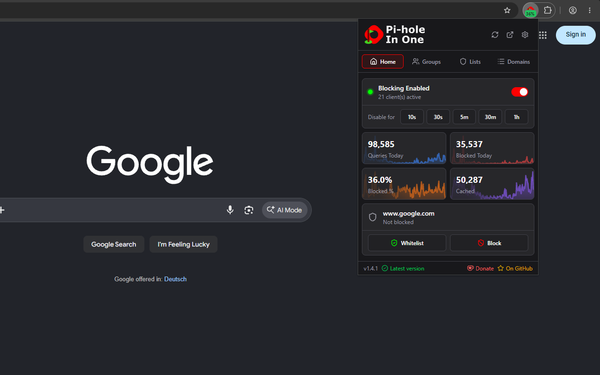
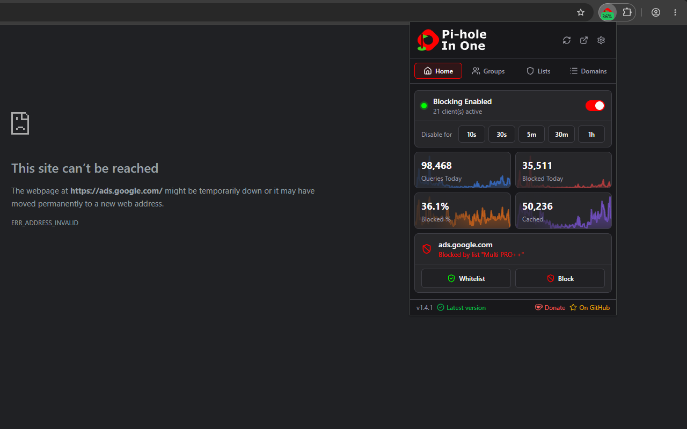
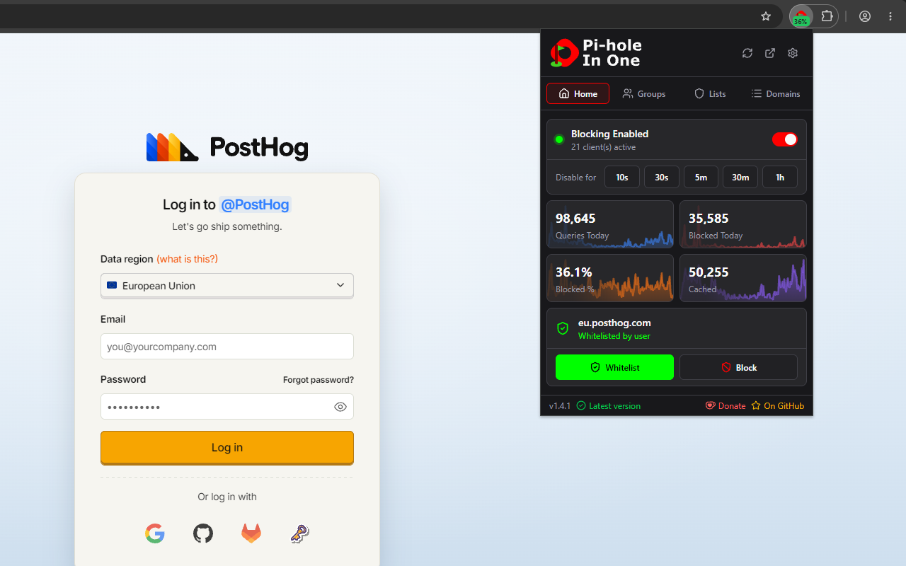
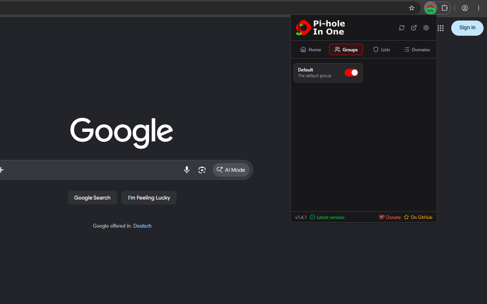
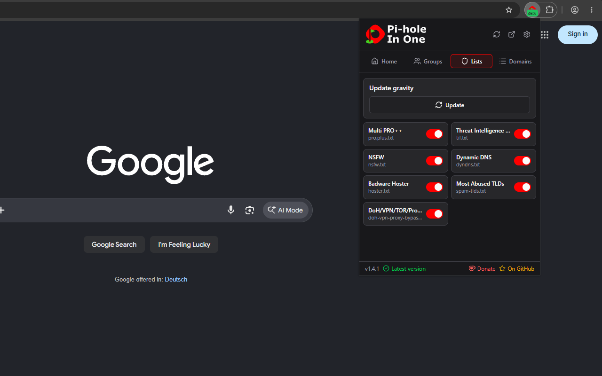
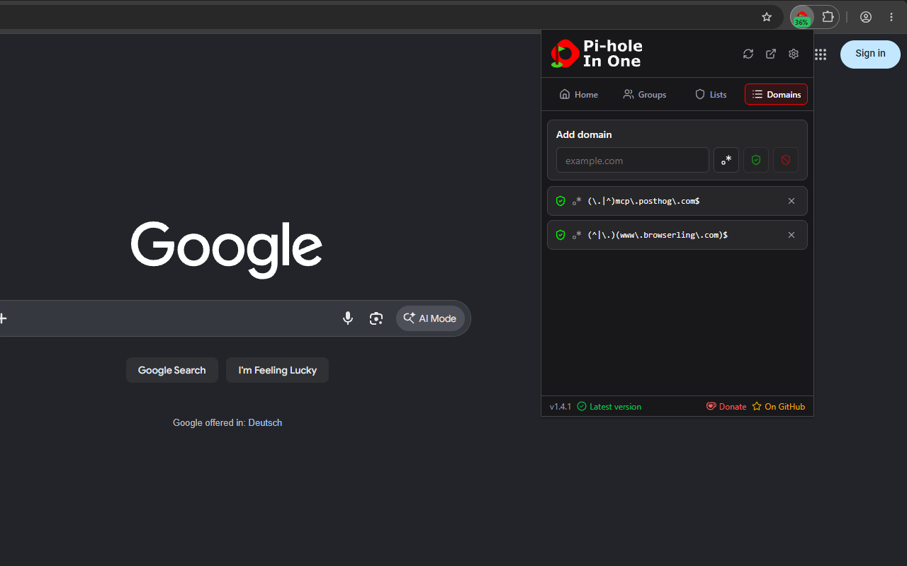
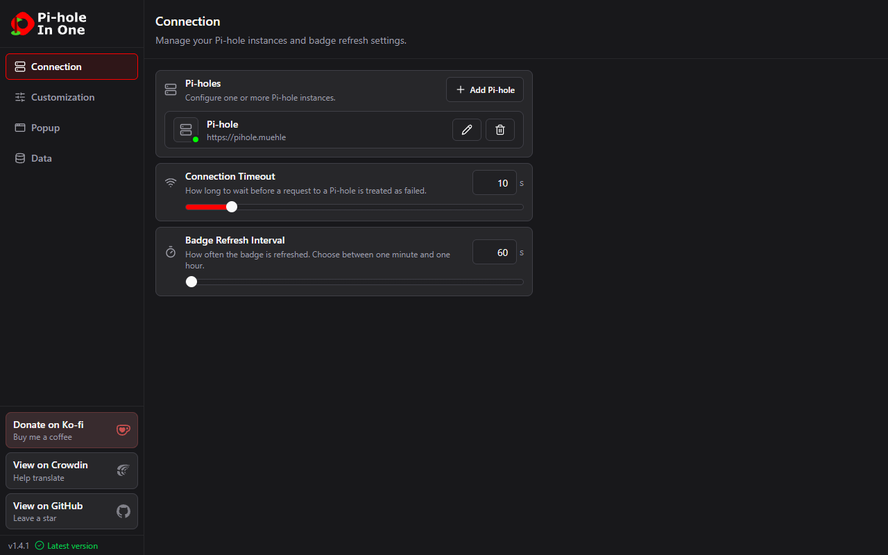
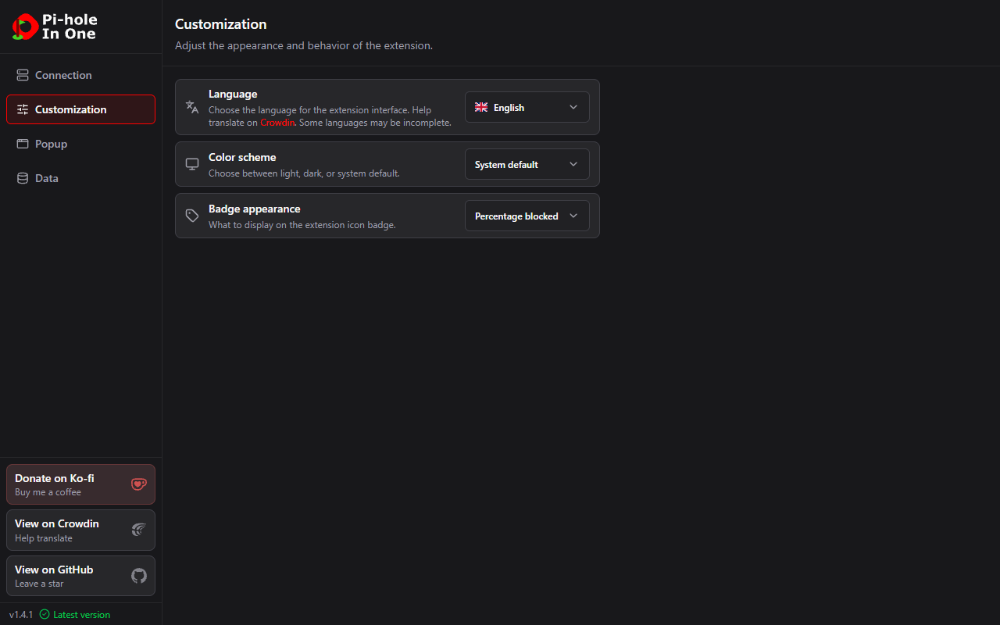
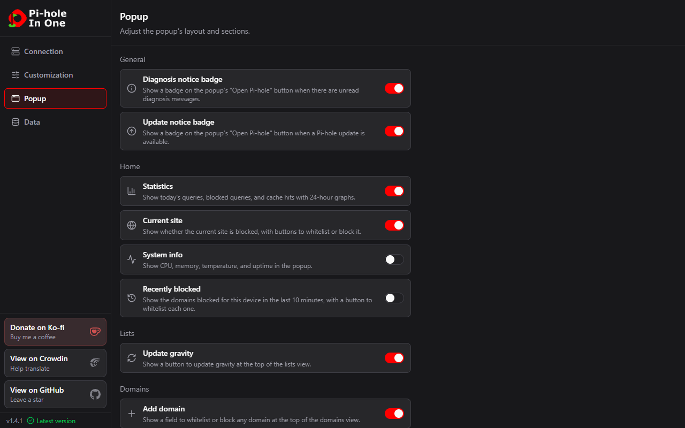
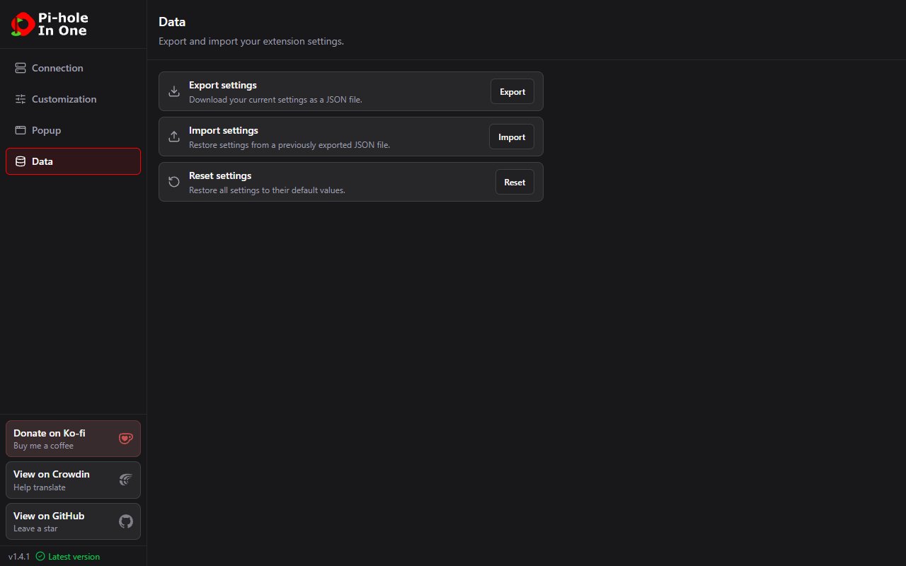

# 

A browser extension to control your Pi-hole conveniently from within the browser.

[](https://github.com/creeperkatze/pihole-js)


[](https://crowdin.com/project/pihole-in-one)


[❓ FAQ](https://pihole-in-one.creeperkatze.dev/faq) •
[📝 Changelog](https://github.com/creeperkatze/pihole-in-one/releases) •
[💬 Discord](https://link.creeperkatze.dev/discord)

[](https://ko-fi.com/creeperkatze)

> [!NOTE]
> The extension is not associated with or endorsed by Pi-hole.

## 🚀 Installation

Install from your browser's extension store:

- **[Chrome Web Store](https://chromewebstore.google.com/detail/pi-hole-in-one/gaaobidjebianpcngcfpkniaocibidhe)** 
- **[Firefox Add-Ons](https://addons.mozilla.org/firefox/addon/pihole-in-one/)** 
- **[Edge Add-Ons](https://microsoftedge.microsoft.com/addons/detail/pihole-in-one/hbigjlhijpiegpnbdhmdgdlfbcgljdao)** 

Prefer to build from source? See [Building from source](#-building-from-source) below.

## 📸 Screenshots

<table>
<tr>
<td width="50%"><br><i>Popup</i></td>
<td width="50%"><br><i>Blocked domain</i></td>
</tr>
<tr>
<td width="50%"><br><i>Allowlisted domain</i></td>
<td width="50%"><br><i>Groups</i></td>
</tr>
<tr>
<td width="50%"><br><i>Lists and gravity</i></td>
<td width="50%"><br><i>Domains</i></td>
</tr>
<tr>
<td width="50%"><br><i>Connection options</i></td>
<td width="50%"><br><i>Customization options</i></td>
</tr>
<tr>
<td width="50%"><br><i>Popup options</i></td>
<td width="50%"><br><i>Data options</i></td>
</tr>
</table>

## ✨ Features

<table>
<tr>
<td width="50%"><b>Blocking control</b><br>Toggle Pi-hole blocking from the popup, or disable it for a preset duration (10s, 30s, 5m, 30m, 1h) so it re-enables automatically.</td>
<td width="50%"><b>Current site</b><br>See whether the current tab's domain is blocked, by you or by a list, and allowlist or block it with one click.</td>
</tr>
<tr>
<td width="50%"><b>Domains</b><br>Allowlist or block any domain, including regex patterns, and remove entries again with one click.</td>
<td width="50%"><b>Groups and lists</b><br>Enable or disable groups and individual blocklists, and update gravity right from the popup.</td>
</tr>
<tr>
<td width="50%"><b>Stats</b><br>View today's queries, blocked queries, block percentage, and cache hits, each with a 24-hour sparkline.</td>
<td width="50%"><b>System info</b><br>See CPU usage, memory usage, temperature, and uptime at a glance.</td>
</tr>
<tr>
<td width="50%"><b>Recently blocked</b><br>See which domains were blocked in the last few minutes, for your device or all devices, and allowlist them with one click.</td>
<td width="50%"><b>Notices</b><br>The popup shows unread Pi-hole diagnosis messages and available Pi-hole updates on its "Open Pi-hole" button.</td>
</tr>
<tr>
<td width="50%"><b>Multiple Pi-holes</b><br>Connect as many Pi-holes as you run, give each its own icon, and switch between them with tabs in the popup.</td>
<td width="50%"><b>Toolbar badge</b><br>Shows blocked percentage, ON/OFF state, or active client count.</td>
</tr>
<tr>
<td width="50%"><b>Customization</b><br>Choose which cards the popup shows, your language, and light or dark mode.</td>
<td width="50%"><b>Settings backup</b><br>Export your settings to a JSON file, import them in another browser, or reset everything to the defaults.</td>
</tr>
</table>

## ⚙️ Setup

1. Open the extension settings.
2. Under **Connection**, click **Add Pi-hole**.
3. Enter your Pi-hole's address (e.g. `pi.hole` or `192.168.1.2`) and your **password** (your admin password, or an app password from Settings > API). Leave the password empty if your Pi-hole has none.
4. Optionally give it a name and an icon, then click **Save** and allow access to your Pi-hole when the browser asks.
5. The dot next to your Pi-hole turns green once it's connected.

> [!TIP]
> If your Pi-hole uses HTTPS with its own certificate, your browser has to trust that certificate first. See the [Pi-hole TLS documentation](https://docs.pi-hole.net/api/tls/).

## 🔒 Building from source

If you don't want to trust the store release, you can build the extension yourself directly from the source code.

**Prerequisites:** [Node.js](https://nodejs.org) and [pnpm](https://pnpm.io)

```bash
# Clone the repository
git clone https://github.com/creeperkatze/pihole-in-one.git
cd pihole-in-one

pnpm install

# Chrome / Edge
pnpm zip

# Firefox
pnpm zip:firefox
```

The resulting zips are placed in `.output/`.

To install the extension manually:

- **Chrome / Edge:** go to `chrome://extensions/`, enable **Developer mode**, then drag and drop the zip onto the page.
- **Firefox:** go to `about:debugging#/runtime/this-firefox`, click **Load Temporary Add-on**, and select the zip. Note that Firefox removes the extension on browser restart since it is loaded as a temporary add-on.

## 👨‍💻 Development

### Setup

```bash
git clone https://github.com/creeperkatze/pihole-in-one.git
cd pihole-in-one

pnpm install
```

### Running

```bash
pnpm dev
```

## 🌐 Translating

Translations are managed on [Crowdin](https://crowdin.com/project/pihole-in-one). You can contribute without any technical knowledge, just pick your language and start translating.

New translations are automatically pulled every Monday.

## 🤝 Contributing

Contributions are always welcome!

Please ensure you run `pnpm lint:fix` before opening a pull request.

## 📜 License

AGPL-3.0
